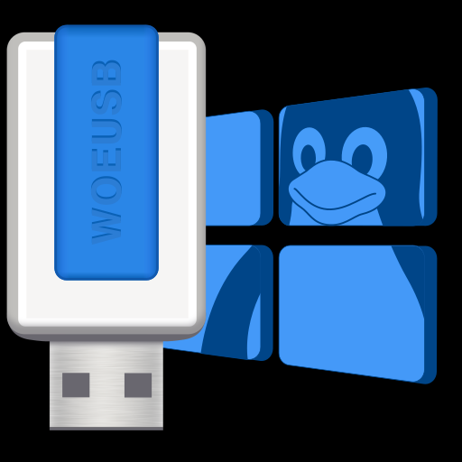

# "Gnome HIG compliant icon" by Lorenzo Ragni

## Editing Software

Pixelmator Pro (non-free)

## Copyright

Info reguarding the copyrighted materials used in this work:

### Component: Tux

Copyright 2016 [gg3po](https://www.pling.com/u/gg3po/), [Iwan Gabovitch](http://qubodup.deviantart.com) \- [Tux Flat SVG](http://qubodup.deviantart.com/art/Tux-Flat-SVG-607655623), based on [File:NewTux.svg](https://commons.wikimedia.org/wiki/File:NewTux.svg "File:NewTux.svg") by [gg3po](https://www.pling.com/u/gg3po/) which is based on [File:Tux.png](https://commons.wikimedia.org/wiki/File:Tux.png "File:Tux.png") by [Larry Ewing](http://isc.tamu.edu/~lewing/linux/)

### Component: "Window"

* Copyright 2021 Lorenzo Ragni <lorenzo.ragni@outlook.it>
* Derived from: [File:Windows logo - 2012.svg - Wikipedia](https://en.wikipedia.org/wiki/File:Windows_logo_-_2012.svg)
    + By: [Fry1989](https://commons.wikimedia.org/wiki/User:Fry1989 "User:Fry1989") (2012)
    + Derived from: [File:Windows 8 logo and wordmark.svg](https://commons.wikimedia.org/wiki/File:Windows_8_logo_and_wordmark.svg "File:Windows 8 logo and wordmark.svg") by Wikimedia Commons contributors
    + Original work: Microsoft
* The trademark usage is [considered fair-use](https://github.com/WoeUSB/WoeUSB-ng/issues/6#issuecomment-780817774) due to:
    + This product is related to a Microsft product(Windows) and is rightfully appear to be so.
    + This product(making Windows installation media under GNU/Linux easier) should, to a reasonable extent, not interfere with Microsoft's interests.
    + The design is intentionally redirected to use the "window" concept, instead of "the logo of a certain Microsoft Windows version", and shall not confuse anyone to be "the logo of a certain Microsoft Windows version"

### Component: USB pendrive

Copyright 2021 Lorenzo Ragni <lorenzo.ragni@outlook.it>

## Reference

* [Gnome HIG compliant icon · Issue #6 · WoeUSB/WoeUSB-ng](https://github.com/WoeUSB/WoeUSB-ng/issues/6)
* [Microsoft Trademark & Brand Guidelines | Trademarks](https://www.microsoft.com/en-us/legal/intellectualproperty/trademarks/usage/general)
* [Publications, Seminars, & Conference Guidelines | Trademarks](https://www.microsoft.com/en-us/legal/intellectualproperty/trademarks/usage/publications.aspx)
